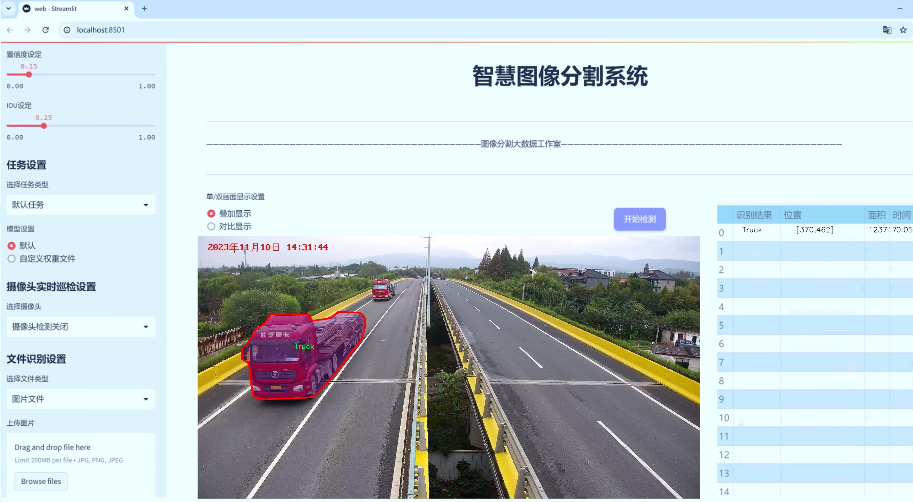
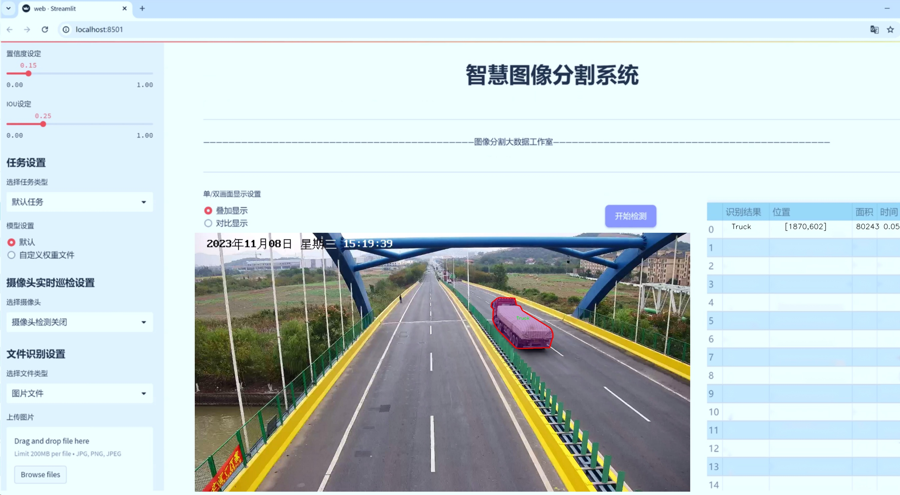
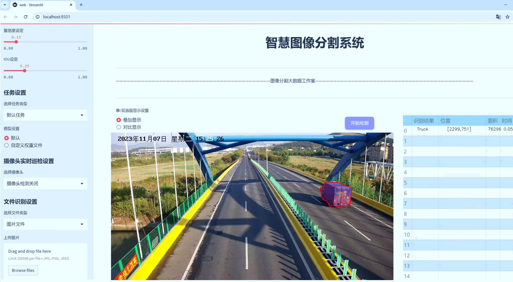
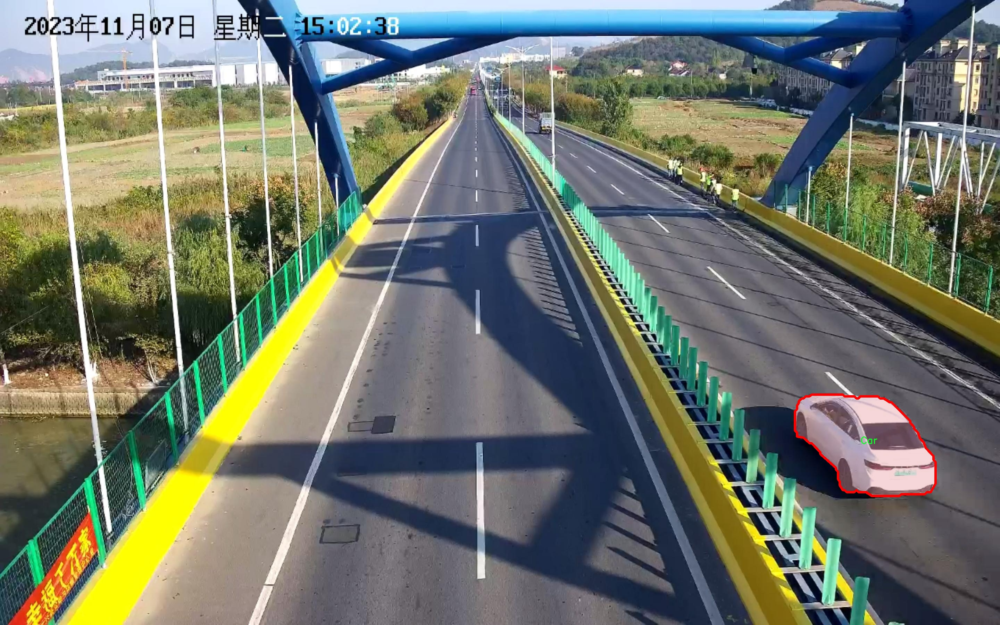
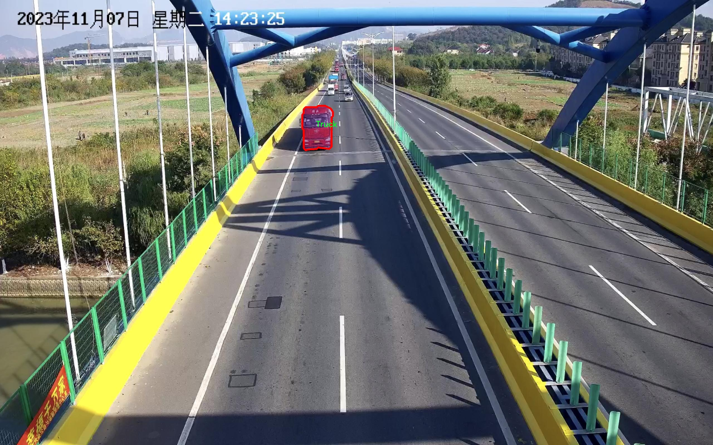
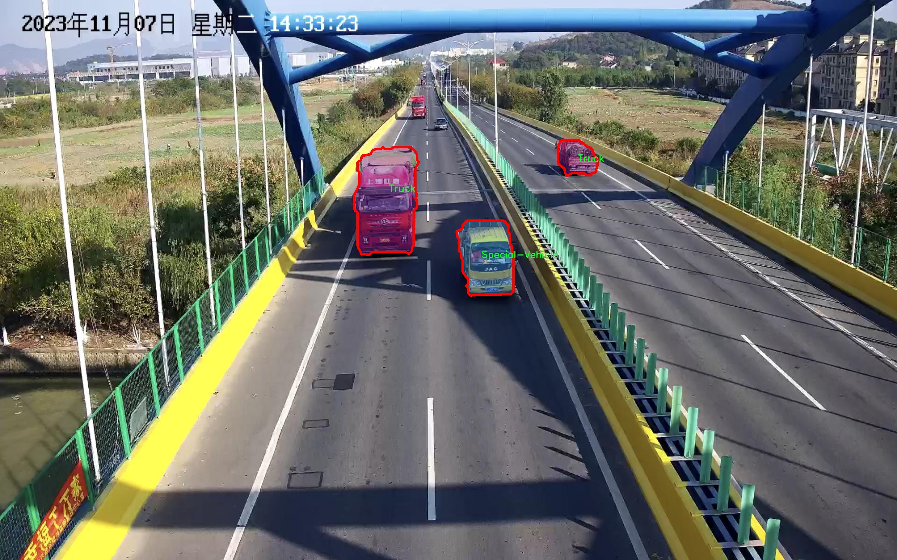
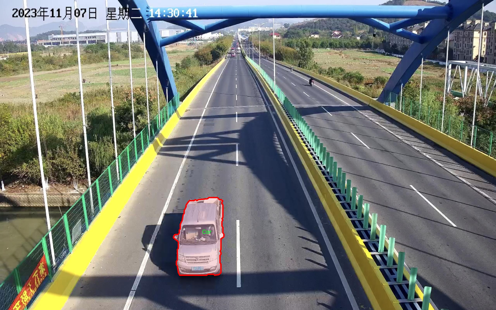
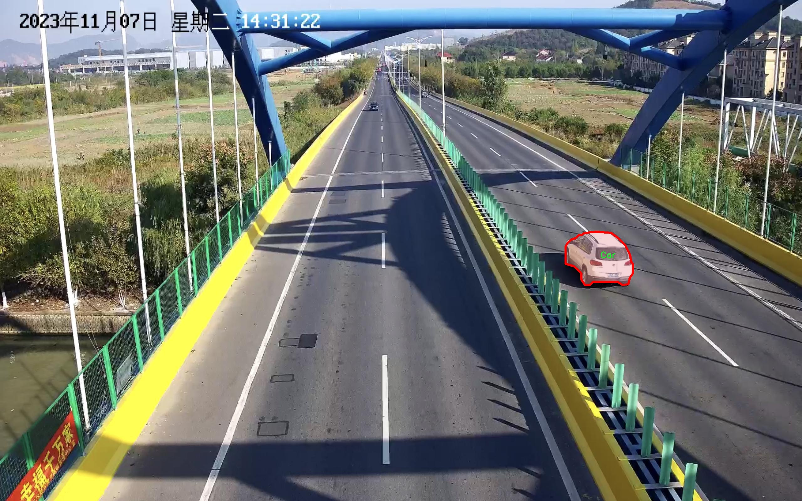

# 监控下车辆类型检测分割系统： yolov8-seg-C2f-Parc

### 1.研究背景与意义

[参考博客](https://gitee.com/YOLOv8_YOLOv11_Segmentation_Studio/projects)

[博客来源](https://kdocs.cn/l/cszuIiCKVNis)

研究背景与意义

随着城市化进程的加快，交通管理与安全问题日益凸显，尤其是在大型城市和交通枢纽区域，车辆类型的准确检测与识别显得尤为重要。传统的交通监控系统多依赖于人工巡查和简单的图像处理技术，难以满足实时性和准确性的要求。近年来，深度学习技术的迅猛发展为计算机视觉领域带来了革命性的变化，尤其是目标检测与分割任务的研究取得了显著进展。YOLO（You Only Look Once）系列模型因其高效的实时检测能力而受到广泛关注，尤其是最新的YOLOv8版本，其在准确性和速度上均有显著提升，为车辆类型检测提供了新的技术路径。

本研究旨在基于改进的YOLOv8模型，构建一个高效的监控下车辆类型检测与分割系统。该系统将专注于五类车辆的检测与分割，包括公交车、轿车、特种车辆、卡车和厢式货车。我们使用的训练数据集包含3900张图像，涵盖了多种场景和光照条件，确保模型在不同环境下的鲁棒性和适应性。通过对数据集的深入分析，我们发现不同类型车辆在外观特征和尺寸上的差异，为模型的改进提供了重要依据。

在车辆检测与分割的过程中，准确的实例分割不仅能够提高车辆类型的识别率，还能为后续的交通流量分析、事故预警和智能交通系统的优化提供重要数据支持。当前，许多城市交通管理系统仍处于信息孤岛状态，缺乏有效的数据整合与分析能力。本研究通过实现车辆类型的自动检测与分割，能够为交通管理部门提供实时、准确的车辆信息，进而提升城市交通的智能化水平。

此外，基于YOLOv8的改进方案将结合先进的图像处理技术，如数据增强、特征融合等，进一步提升模型的检测精度和处理速度。我们将探索如何通过优化网络结构和调整超参数，最大限度地提高模型在复杂场景下的表现。研究结果不仅将为学术界提供新的思路和方法，也将为实际应用提供切实可行的解决方案。

综上所述，本研究不仅具有重要的理论意义，还具备广泛的应用前景。通过构建基于改进YOLOv8的车辆类型检测与分割系统，我们希望能够为城市交通管理提供更为精准的数据支持，推动智能交通系统的发展。同时，本研究也将为深度学习在交通领域的应用提供新的实践案例，促进相关技术的进一步发展与创新。

### 2.图片演示







注意：本项目提供完整的训练源码数据集和训练教程,由于此博客编辑较早,暂不提供权重文件（best.pt）,需要按照6.训练教程进行训练后实现上图效果。

### 3.视频演示

[3.1 视频演示](https://www.bilibili.com/video/BV1g8moYiENP/)

### 4.数据集信息

##### 4.1 数据集类别数＆类别名

nc: 5
names: ['Bus', 'Car', 'Special-Vehicle', 'Truck', 'Van']


##### 4.2 数据集信息简介

数据集信息展示

在本研究中，我们使用了名为“Vehicle Height Detection”的数据集，以训练和改进YOLOv8-seg模型，旨在实现对监控下车辆类型的高效检测与分割。该数据集的设计初衷是为了解决交通监控中车辆分类和高度检测的实际需求，尤其是在城市交通管理、智能交通系统和自动驾驶等领域。通过对不同类型车辆的精确识别与分割，我们希望能够提升监控系统的智能化水平，为后续的数据分析和决策提供可靠的基础。

“Vehicle Height Detection”数据集包含五个主要类别，分别是：公交车（Bus）、小汽车（Car）、特种车辆（Special-Vehicle）、卡车（Truck）和面包车（Van）。这些类别的选择反映了现代交通环境中常见的车辆类型，涵盖了从公共交通到货运、以及特种用途车辆的多样性。每个类别在数据集中都包含了大量的图像样本，这些样本不仅展示了车辆的不同外观特征，还涵盖了各种环境条件下的拍摄场景，例如不同的光照、天气和角度变化，这为模型的训练提供了丰富的多样性。

在数据集的构建过程中，研究团队注重了数据的标注质量和准确性。每张图像都经过仔细的标注，确保每种车辆类型都能被清晰地识别和分割。通过使用高精度的标注工具，研究人员能够为每个类别的车辆提供精确的边界框和分割掩码，这为YOLOv8-seg模型的训练提供了坚实的基础。模型通过学习这些标注信息，能够在实际应用中实现高效的车辆检测与分类，进而提升监控系统的响应速度和准确性。

此外，数据集还包含了车辆高度的相关信息，这一特征在交通管理中尤为重要。通过对车辆高度的检测，监控系统能够更好地识别和分类不同类型的车辆，尤其是在需要进行高度限制管理的区域，例如桥梁、隧道等。这种信息的整合不仅提升了模型的功能性，也为交通管理部门提供了更为全面的数据支持，帮助其制定更为科学的交通政策。

在数据集的使用过程中，我们还进行了多次的数据增强处理，以提高模型的鲁棒性和泛化能力。通过旋转、缩放、裁剪等多种方式，生成了大量的变体图像，使得模型能够在面对不同场景和条件时，依然保持良好的性能。这种增强策略有效地扩展了数据集的有效样本量，帮助模型更好地适应现实世界中的复杂情况。

综上所述，“Vehicle Height Detection”数据集不仅为YOLOv8-seg模型的训练提供了丰富的样本和标注信息，还通过对车辆类型和高度的全面考虑，提升了监控系统在实际应用中的有效性和可靠性。随着技术的不断进步，我们期待该数据集能够为未来的智能交通系统发展贡献更多的价值。











### 5.项目依赖环境部署教程（零基础手把手教学）

[5.1 环境部署教程链接（零基础手把手教学）](https://www.bilibili.com/video/BV1jG4Ve4E9t/?vd_source=bc9aec86d164b67a7004b996143742dc)


[5.2 安装Python虚拟环境创建和依赖库安装视频教程链接（零基础手把手教学）](https://www.bilibili.com/video/BV1nA4VeYEze/?vd_source=bc9aec86d164b67a7004b996143742dc)

### 6.手把手YOLOV8-seg训练视频教程（零基础手把手教学）

[6.1 手把手YOLOV8-seg训练视频教程（零基础小白有手就能学会）](https://www.bilibili.com/video/BV1cA4VeYETe/?vd_source=bc9aec86d164b67a7004b996143742dc)


按照上面的训练视频教程链接加载项目提供的数据集，运行train.py即可开始训练



     Epoch   gpu_mem       box       obj       cls    labels  img_size
     1/200     0G   0.01576   0.01955  0.007536        22      1280: 100%|██████████| 849/849 [14:42<00:00,  1.04s/it]
               Class     Images     Labels          P          R     mAP@.5 mAP@.5:.95: 100%|██████████| 213/213 [01:14<00:00,  2.87it/s]
                 all       3395      17314      0.994      0.957      0.0957      0.0843

     Epoch   gpu_mem       box       obj       cls    labels  img_size
     2/200     0G   0.01578   0.01923  0.007006        22      1280: 100%|██████████| 849/849 [14:44<00:00,  1.04s/it]
               Class     Images     Labels          P          R     mAP@.5 mAP@.5:.95: 100%|██████████| 213/213 [01:12<00:00,  2.95it/s]
                 all       3395      17314      0.996      0.956      0.0957      0.0845

     Epoch   gpu_mem       box       obj       cls    labels  img_size
     3/200     0G   0.01561    0.0191  0.006895        27      1280: 100%|██████████| 849/849 [10:56<00:00,  1.29it/s]
               Class     Images     Labels          P          R     mAP@.5 mAP@.5:.95: 100%|███████   | 187/213 [00:52<00:00,  4.04it/s]
                 all       3395      17314      0.996      0.957      0.0957      0.0845


### 7.50+种全套YOLOV8-seg创新点加载调参实验视频教程（一键加载写好的改进模型的配置文件）

[7.1 50+种全套YOLOV8-seg创新点加载调参实验视频教程（一键加载写好的改进模型的配置文件）](https://www.bilibili.com/video/BV1Hw4VePEXv/?vd_source=bc9aec86d164b67a7004b996143742dc)

### YOLOV8-seg算法简介

原始YOLOv8-seg算法原理

YOLOv8-seg算法是YOLO系列中的最新版本，结合了目标检测与图像分割的能力，旨在实现更高效、更准确的视觉任务处理。该算法在YOLOv7的基础上进行了多项优化，特别是在卷积神经网络结构的深度和复杂性上进行了增强。通过将整个图像作为输入，YOLOv8-seg能够直接在图像上进行目标检测和分割，而无需依赖传统的滑动窗口或区域提议方法，这种创新显著提高了检测的精度和速度。

在YOLOv8-seg中，特征提取的核心是一个改进的骨干网络，采用了CSPDarknet结构。这种结构通过引入多个残差块，能够有效地捕捉图像中的重要特征。相较于前代模型，YOLOv8-seg在特征提取过程中使用了C2f模块替代了C3模块。C2f模块的设计使得输入特征图被分为两个分支，经过独立的卷积层进行降维处理，这种并行的特征处理方式不仅提高了模型的计算效率，还增强了特征的表达能力。通过这种方式，YOLOv8-seg能够在保持高效性的同时，获得更丰富的特征信息，从而提升后续的目标检测和分割性能。

特征融合是YOLOv8-seg的另一个关键环节。该算法引入了特征金字塔网络（FPN）和路径聚合网络（PAN），这两者的结合使得模型能够在不同尺度上有效地提取和融合特征。FPN通过自底向上的结构，能够在不同层次上获取多尺度特征，而PAN则通过自顶向下的方式，增强了特征的传递和融合。这样的设计使得YOLOv8-seg在处理复杂场景时，能够更好地应对目标大小变化和形状多样性，从而提高了检测和分割的准确性。

在目标检测的过程中，YOLOv8-seg采用了一种无锚框（Anchor-Free）的检测方式。这种方法通过直接预测目标的中心点和宽高比例，避免了传统锚框方法中存在的超参数选择和设计的复杂性。无锚框的设计不仅简化了模型的结构，还提高了检测速度和准确度，使得YOLOv8-seg在实时应用中表现出色。此外，YOLOv8-seg还引入了多尺度训练和测试策略，通过在不同尺度下训练模型，进一步提升了其对各种目标的适应能力。

在图像分割方面，YOLOv8-seg通过将目标检测与分割任务相结合，实现了更为精细的视觉理解。算法通过对目标区域的精确定位，能够生成高质量的分割掩码，适用于各种应用场景，如智能监控、自动驾驶、医学影像分析等。分割的精度和速度在YOLOv8-seg中得到了显著提升，使得该算法在实际应用中具有更高的实用价值。

YOLOv8-seg的轻量化设计也是其一大亮点。为了满足在边缘设备上的应用需求，YOLOv8-seg在模型结构上进行了优化，使用了更轻量化的C2F模块和解耦头替代传统的耦合头。这种设计不仅减少了模型的参数量和计算量，还保持了较高的检测精度。通过这种轻量化的设计，YOLOv8-seg能够在资源受限的环境中，依然实现高效的目标检测和分割。

总的来说，YOLOv8-seg算法通过深度优化的卷积神经网络结构、创新的特征提取与融合策略、无锚框的检测方式以及高效的图像分割能力，展现出了卓越的性能。其在目标检测和分割任务中的出色表现，使其成为了当前计算机视觉领域中的一项重要技术，能够广泛应用于智能监控、自动驾驶、机器人视觉等多个领域。随着YOLOv8-seg的不断发展与完善，未来在视觉任务中的应用前景将更加广阔。


### 9.系统功能展示（检测对象为举例，实际内容以本项目数据集为准）

图9.1.系统支持检测结果表格显示

  图9.2.系统支持置信度和IOU阈值手动调节

  图9.3.系统支持自定义加载权重文件best.pt(需要你通过步骤5中训练获得)

  图9.4.系统支持摄像头实时识别

  图9.5.系统支持图片识别

  图9.6.系统支持视频识别

  图9.7.系统支持识别结果文件自动保存

  图9.8.系统支持Excel导出检测结果数据


### 10.50+种全套YOLOV8-seg创新点原理讲解（非科班也可以轻松写刊发刊，V11版本正在科研待更新）

#### 10.1 由于篇幅限制，每个创新点的具体原理讲解就不一一展开，具体见下列网址中的创新点对应子项目的技术原理博客网址【Blog】：


[10.1 50+种全套YOLOV8-seg创新点原理讲解链接](https://gitee.com/qunmasj/good)

#### 10.2 部分改进模块原理讲解(完整的改进原理见上图和技术博客链接)【如果此小节的图加载失败可以通过CSDN或者Github搜索该博客的标题访问原始博客，原始博客图片显示正常】
### YOLOv8简介
YOLOv8目标检测算法继承了YOLOv1系列的思考,是一种新型端到端的目标检测算法,尽管现在原始检测算法已经开源,但是鲜有发表的相关论文.YOLOv8的网络结构如图所示,主要可分为Input输入端、Backbone骨干神经网络、Neck 混合特征网络层和Head预测层网络共4个部分.

YOLO目标检测算法是一种端到端的One-Slage 目标检测算法，其核心思想是将图像按区域分块进行预测。YOLO将输入图像按照32x32的大小划分成若干个网格，例如416x416的图像将被划分为13x13个网格。当目标物体的中心位于某个网格内时,该网格就会负责输出该物体的边界框和类别置信度。每个网格可以预测多个边界框和多个目标类别,这些边界框和类别的数量可以根据需要进行设置。YOLO算法的输出是一个特征图,包含了每个网格对应的边界框和类别置信度的信息呵。本文采用YOLO最新的YOLOv8模型，其是2022年底发布的最新YOLO系列模型，采用全新的SOTA模型，全新的网络主干结构,如图1所示。
整个网络分为Backbone 骨干网络部分和Head头部网络部分。YOLOv8汲取了前几代网络的优秀特性，骨干网络和 Neck部分遵循CSP的思想，将YOLOv5中的C3模块被替换成了梯度流更丰富C2模块,去掉YOLOv5中 PAN-FPN上采样阶段中的卷积结构,将Backbone不同阶段输出的特征直接送入了上采样操作,模型提供了N/S/M/L/X尺度的不同大小模型,能够满足不同领域业界的需求。本文基于YOLOv8模型设计番茄病虫害检测系统，通过配置模型参数训练番茄图像,得到能够用于部署应用的最优模型。


### 感受野注意力卷积（RFAConv)
#### 标准卷积操作回顾
标准的卷积操作是构造卷积神经网络的基本构件。它利用具有共享参数的滑动窗口提取特征信息，克服了全连通层构造神经网络固有的参数多、计算开销大的问题。设 X R∈C×H×W
表示输入特征图，其中C、H、W分别表示特征图的通道数、高度、宽度。为了清楚地演示卷积核的特征提取过程，我们使用 C = 1 的例子。从每个接受域滑块中提取特征信息的卷积运算可以表示为:


这里，Fi 表示计算后每个卷积滑块得到的值，Xi 表示每个滑块内对应位置的像素值，K表示卷积核，S表示卷积核中的参数个数，N表示接收域滑块的总数。可以看出，每个滑块内相同位置的 feature共享相同的参数Ki。因此，标准的卷积运算并不能捕捉到不同位置所带来的信息差异，这最终在一定程度上限制了卷积神经网络的性能。 

#### 空间注意力回顾
目前，空间注意机制是利用学习得到的注意图来突出每个特征的重要性。与前一节类似，这里以 C=1为例。突出关键特征的空间注意机制可以简单表述为:这里，Fi 表示加权运算后得到的值。xi 和Ai 表示输入特征图和学习到的注意图在不同位置的值，N为输入特征图的高和宽的乘积，表示像素值的总数。


#### 空间注意与标准卷积运算
将注意力机制整合到卷积神经网络中，可以提高卷积神经网络的性能。通过对标准卷积运算和现有空间注意机制的研究，我们认为空间注意机制有效地克服了卷积神经网络固有的参数共享的局限性。目前卷积神经网络中最常用的核大小是 1 × 1和3 × 3。在引入空间注意机制后，提取特征的卷积操作可以是 1 × 1或3 × 3卷积操作。为了直观地展示这个过程，在 1 × 1卷积运算的前面插入了空间注意机制。通过注意图对输入特征图(Re-weight“×”)进行加权运算，最后通过 1 × 1卷积运算提取接收域的滑块特征信息。整个过程可以简单地表示如下:


 这里卷积核K仅代表一个参数值。如果取A i× ki 的值作为一种新的卷积核参数，有趣的是它解决了 1×1卷积运算提取特征时的参数共享问题。然而，关于空间注意机制的传说到此结束。当空间注意机制被插入到3×3卷积运算前面时。具体情况如下:


如上所述，如果取A的值 i × ki (4)式作为一种新的卷积核参数，完全解决了大规模卷积核的参数共享问题。然而，最重要的一点是，卷积核在提取每个接受域滑块的特征时，会共享一些特征。换句话说，每个接收域滑块内都有一个重叠。仔细分析后会发现A12= a21， a13 = a22， a15 = a24……，在这种情况下，每个滑动窗口共享空间注意力地图的权重。因此，空间注意机制没有考虑整个接受域的空间特征，不能有效地解决大规模卷积核的参数共享问题。因此，空间注意机制的有效性受到限制。 

#### 创新空间注意力和标准卷积操作
该博客提出解决了现有空间注意机制的局限性，为空间处理提供了一种创新的解决方案。受RFA的启发，一系列空间注意机制被开发出来，可以进一步提高卷积神经网络的性能。RFA可以看作是一个轻量级即插即用模块，RFA设计的卷积运算(RFAConv)可以代替标准卷积来提高卷积神经网络的性能。因此，我们预测空间注意机制与标准卷积运算的结合将继续发展，并在未来带来新的突破。
接受域空间特征:为了更好地理解接受域空间特征的概念，我们将提供相关的定义。接收域空间特征是专门为卷积核设计的，并根据核大小动态生成。如图1所示，以3×3卷积核为例。在图1中，“Spatial Feature”指的是原始的Feature map。“接受域空间特征”是空间特征变换后的特征图。

 

由不重叠的滑动窗口组成。当使用 3×3卷积内核提取特征时，接收域空间特征中的每个 3×3大小窗口代表一个接收域滑块。接受域注意卷积(RFAConv):针对接受域的空间特征，我们提出了接受域注意卷积(RFA)。该方法不仅强调了接收域滑块内不同特征的重要性，而且对接收域空间特征进行了优先排序。通过该方法，完全解决了卷积核参数共享的问题。接受域空间特征是根据卷积核的大小动态生成的，因此，RFA是卷积的固定组合，不能与卷积操作的帮助分离，卷积操作同时依赖于RFA来提高性能，因此我们提出了接受场注意卷积(RFAConv)。具有3×3大小的卷积核的RFAConv整体结构如图所示。


目前，最广泛使用的接受域特征提取方法是缓慢的。经过大量的研究，我们开发了一种快速的方法，用分组卷积来代替原来的方法。具体来说，我们利用相应大小的分组卷积来动态生成基于接受域大小的展开特征。尽管与原始的无参数方法(如PyTorch提供的nn.())相比，该方法增加了一些参数，但它的速度要快得多。注意:如前一节所述，当使用 3×3卷积内核提取特征时，接收域空间特征中的每个 3×3大小窗口表示一个接收域滑块。而利用快速分组卷积提取感受野特征后，将原始特征映射为新的特征。最近的研究表明。交互信息可以提高网络性能，如[40,41,42]所示。同样，对于RFAConv来说，通过交互接受域特征信息来学习注意图可以提高网络性能。然而，与每个接收域特征交互会导致额外的计算开销，因此为了最小化计算开销和参数的数量，我们使用AvgPool来聚合每个接收域特征的全局信息。然后，使用 1×1 组卷积操作进行信息交互。最后，我们使用softmax来强调每个特征在接受域特征中的重要性。一般情况下，RFA的计算可以表示为:


这里gi×i 表示一个大小为 i×i的分组卷积，k表示卷积核的大小，Norm表示归一化，X表示输入的特征图，F由注意图 a相乘得到 rf 与转换后的接受域空间特征 Frf。与CBAM和CA不同，RFA能够为每个接受域特征生成注意图。卷积神经网络的性能受到标准卷积操作的限制，因为卷积操作依赖于共享参数，对位置变化带来的信息差异不敏感。然而，RFAConv通过强调接收域滑块中不同特征的重要性，并对接收域空间特征进行优先级排序，可以完全解决这个问题。通过RFA得到的feature map是接受域空间特征，在“Adjust Shape”后没有重叠。因此，学习到的注意图将每个接受域滑块的特征信息聚合起来。换句话说，注意力地图不再共享在每个接受域滑块。这完全弥补了现有 CA和CBAM注意机制的不足。RFA为标准卷积内核提供了显著的好处。而在调整形状后，特征的高度和宽度是 k倍，需要进行 stride = k的k × k卷积运算来提取特征信息。RFA设计的卷积运算RFAConv为卷积带来了良好的增益，对标准卷积进行了创新。
此外，我们认为现有的空间注意机制应该优先考虑接受域空间特征，以提高网络性能。众所周知，基于自注意机制的网络模型[43,44,45]取得了很大的成功，因为它解决了卷积参数共享的问题，并对远程信息进行建模。然而，自注意机制也为模型引入了显著的计算开销和复杂性。我们认为，将现有的空间注意机制的注意力引导到接受场空间特征上，可以以类似于自我注意的方式解决长期信息的参数共享和建模问题。与自我关注相比，这种方法需要的参数和计算资源少得多。答案如下:(1)将以接收场空间特征为中心的空间注意机制与卷积相结合，消除了卷积参数共享的问题。(2)现有的空间注意机制已经考虑了远程信息，可以通过全局平均池或全局最大池的方式获取全局信息，其中明确考虑了远程信息。因此，我们设计了新的 CBAM和CA模型，称为RFCBAM和RFCA，它们专注于接受域空间特征。与RFA类似，使用最终的k × k stride = k 的卷积运算来提取特征信息。这两种新的卷积方法的具体结构如图 3所示，我们称这两种新的卷积操作为 RFCBAMConv和RFCAConv。与原来的CBAM相比，我们在RFCBAM中使用SE attention来代替CAM。因为这样可以减少计算开销。此外，在RFCBAM中，通道注意和空间注意不是分开执行的。相反，它们是同时加权的，使得每个通道获得的注意力地图是不同的。


### 11.项目核心源码讲解（再也不用担心看不懂代码逻辑）

#### 11.1 ultralytics\engine\validator.py

以下是经过简化和注释的核心代码部分，保留了主要功能和结构，并添加了详细的中文注释：

```python
import json
import time
import torch
from ultralytics.cfg import get_cfg, get_save_dir
from ultralytics.utils import LOGGER, TQDM, callbacks
from ultralytics.utils.checks import check_imgsz
from ultralytics.utils.ops import Profile
from ultralytics.nn.autobackend import AutoBackend

class BaseValidator:
    """
    BaseValidator类用于创建验证器的基类。

    属性:
        args: 验证器的配置参数。
        dataloader: 用于验证的数据加载器。
        model: 要验证的模型。
        device: 用于验证的设备。
        speed: 各个阶段的处理速度。
        save_dir: 保存结果的目录。
    """

    def __init__(self, dataloader=None, save_dir=None, args=None):
        """
        初始化BaseValidator实例。

        参数:
            dataloader: 用于验证的数据加载器。
            save_dir: 保存结果的目录。
            args: 验证器的配置参数。
        """
        self.args = get_cfg(overrides=args)  # 获取配置
        self.dataloader = dataloader
        self.model = None
        self.device = None
        self.speed = {'preprocess': 0.0, 'inference': 0.0, 'loss': 0.0, 'postprocess': 0.0}
        self.save_dir = save_dir or get_save_dir(self.args)  # 设置保存目录
        self.args.imgsz = check_imgsz(self.args.imgsz, max_dim=1)  # 检查图像尺寸

    def __call__(self, model=None):
        """执行验证过程。"""
        self.device = select_device(self.args.device)  # 选择设备
        self.model = AutoBackend(model or self.args.model, device=self.device)  # 初始化模型
        self.model.eval()  # 设置模型为评估模式

        # 初始化进度条
        bar = TQDM(self.dataloader, desc='Validating', total=len(self.dataloader))
        for batch_i, batch in enumerate(bar):
            # 预处理
            batch = self.preprocess(batch)

            # 推理
            preds = self.model(batch['img'])

            # 更新指标
            self.update_metrics(preds, batch)

        # 打印结果
        self.print_results()

    def preprocess(self, batch):
        """预处理输入批次。"""
        return batch  # 这里可以添加实际的预处理逻辑

    def update_metrics(self, preds, batch):
        """根据预测和批次更新指标。"""
        pass  # 这里可以添加更新指标的逻辑

    def print_results(self):
        """打印模型预测的结果。"""
        pass  # 这里可以添加打印结果的逻辑

# 下面可以添加更多的功能函数，例如用于评估的函数等
```

### 代码分析
1. **类的定义**: `BaseValidator` 是一个基类，用于实现模型验证的基本功能。
2. **初始化方法**: `__init__` 方法中初始化了配置参数、数据加载器、模型、设备等基本属性。
3. **调用方法**: `__call__` 方法是执行验证的主要逻辑，包括模型的推理和指标更新。
4. **预处理和更新指标**: `preprocess` 和 `update_metrics` 方法是占位符，后续可以根据需要实现具体的逻辑。
5. **打印结果**: `print_results` 方法用于输出最终的验证结果。

### 备注
- 代码中使用了 `TQDM` 来显示进度条，增强用户体验。
- 具体的预处理、指标更新和结果打印逻辑需要根据实际需求进行实现。

这个文件是一个用于验证模型准确性的基类，主要用于YOLO（You Only Look Once）系列模型的验证过程。它提供了一些方法和属性，用于处理验证过程中的数据加载、模型推理、结果统计等功能。

首先，文件中定义了一个名为`BaseValidator`的类，该类的构造函数接收多个参数，包括数据加载器、保存结果的目录、进度条、配置参数和回调函数等。构造函数会初始化一些属性，例如模型、设备、批次索引、训练状态、类别名称、统计信息等。同时，它还会创建保存结果的目录，并检查输入图像的尺寸。

`BaseValidator`类的核心功能通过`__call__`方法实现，该方法支持对预训练模型或正在训练的模型进行验证。根据是否传入训练器对象，方法会设置不同的设备和数据，进行模型的评估。在评估过程中，它会进行数据预处理、模型推理、损失计算和后处理，并更新验证指标。验证完成后，会打印结果并保存相关数据。

类中还定义了一些辅助方法，例如`match_predictions`用于将预测结果与真实标签进行匹配，`add_callback`和`run_callbacks`用于处理回调函数，`get_dataloader`和`build_dataset`是用于获取数据加载器和构建数据集的抽象方法，`preprocess`和`postprocess`用于对输入批次和预测结果进行处理。

此外，类中还包含了一些用于初始化和更新指标的方法，如`init_metrics`、`update_metrics`、`finalize_metrics`和`get_stats`，这些方法在具体实现时需要根据实际需求进行扩展。

总的来说，这个文件为YOLO模型的验证提供了一个基础框架，允许用户根据需要进行扩展和定制，以适应不同的验证场景和需求。

#### 11.2 ultralytics\data\augment.py

以下是经过简化和注释的核心代码部分，主要包括数据增强的相关类和方法。注释详细解释了每个类和方法的功能和实现细节。

```python
import random
import numpy as np
import cv2

class BaseTransform:
    """
    基础图像变换类，用于定义一系列图像处理操作。
    """

    def __init__(self) -> None:
        """初始化基础变换对象。"""
        pass

    def apply_image(self, labels):
        """应用图像变换到标签。"""
        pass

    def apply_instances(self, labels):
        """应用变换到标签中的对象实例。"""
        pass

    def apply_semantic(self, labels):
        """应用语义分割变换到图像。"""
        pass

    def __call__(self, labels):
        """应用所有标签变换到图像、实例和语义掩码。"""
        self.apply_image(labels)
        self.apply_instances(labels)
        self.apply_semantic(labels)


class Compose:
    """
    组合多个图像变换的类。
    """

    def __init__(self, transforms):
        """初始化组合对象，接收变换列表。"""
        self.transforms = transforms

    def __call__(self, data):
        """依次应用一系列变换到输入数据。"""
        for t in self.transforms:
            data = t(data)
        return data


class Mosaic(BaseTransform):
    """
    马赛克增强类，通过将多个图像组合成一个马赛克图像来进行数据增强。
    """

    def __init__(self, dataset, imgsz=640, p=1.0, n=4):
        """初始化马赛克对象，设置数据集、图像大小、应用概率和网格大小。"""
        assert 0 <= p <= 1.0, f'概率应在[0, 1]范围内，但得到的是 {p}.'
        assert n in (4, 9), '网格大小必须为4或9。'
        self.dataset = dataset
        self.imgsz = imgsz
        self.p = p
        self.n = n

    def get_indexes(self):
        """返回数据集中随机选择的索引列表。"""
        return random.sample(range(len(self.dataset)), self.n - 1)

    def _mix_transform(self, labels):
        """应用马赛克增强到标签字典。"""
        return self._mosaic4(labels) if self.n == 4 else self._mosaic9(labels)

    def _mosaic4(self, labels):
        """创建一个2x2的图像马赛克。"""
        mosaic_labels = []
        s = self.imgsz
        # 计算马赛克中心
        yc, xc = (random.randint(-s // 2, s) for _ in range(2))
        for i in range(4):
            # 加载图像并放置到马赛克图像中
            img = labels['mix_labels'][i] if i > 0 else labels
            h, w = img['resized_shape']
            # 计算放置位置
            # 省略具体位置计算代码...
            mosaic_labels.append(img)  # 添加图像到马赛克标签列表
        final_labels = self._cat_labels(mosaic_labels)
        final_labels['img'] = img4  # 更新最终图像
        return final_labels

    def _cat_labels(self, mosaic_labels):
        """合并马赛克标签并返回。"""
        # 省略具体合并逻辑...
        return final_labels


class RandomFlip:
    """
    随机翻转图像的类，支持水平或垂直翻转。
    """

    def __init__(self, p=0.5, direction='horizontal'):
        """初始化随机翻转对象，设置翻转概率和方向。"""
        assert direction in ['horizontal', 'vertical'], '方向必须为“horizontal”或“vertical”。'
        self.p = p
        self.direction = direction

    def __call__(self, labels):
        """应用随机翻转到图像和实例。"""
        img = labels['img']
        if self.direction == 'vertical' and random.random() < self.p:
            img = np.flipud(img)  # 垂直翻转
        if self.direction == 'horizontal' and random.random() < self.p:
            img = np.fliplr(img)  # 水平翻转
        labels['img'] = img
        return labels


class RandomPerspective:
    """
    随机透视变换类，应用旋转、平移、缩放和剪切等变换。
    """

    def __init__(self, degrees=0.0, translate=0.1, scale=0.5, shear=0.0, perspective=0.0):
        """初始化随机透视对象，设置变换参数。"""
        self.degrees = degrees
        self.translate = translate
        self.scale = scale
        self.shear = shear
        self.perspective = perspective

    def __call__(self, labels):
        """应用随机透视变换到图像和目标。"""
        img = labels['img']
        # 省略具体变换逻辑...
        labels['img'] = img  # 更新图像
        return labels


# 示例：使用组合类来应用多个变换
def v8_transforms(dataset, imgsz):
    """定义YOLOv8训练所需的图像变换。"""
    return Compose([
        Mosaic(dataset, imgsz=imgsz, p=1.0, n=4),
        RandomFlip(p=0.5, direction='horizontal'),
        RandomPerspective(degrees=10, translate=0.1, scale=0.1)
    ])
```

以上代码中，`BaseTransform` 类定义了图像变换的基本结构，`Compose` 类用于组合多个变换，`Mosaic` 类实现了马赛克增强，`RandomFlip` 和 `RandomPerspective` 类分别实现了随机翻转和随机透视变换。每个类和方法都包含了详细的中文注释，便于理解其功能和实现逻辑。

这个程序文件 `ultralytics\data\augment.py` 是用于图像增强的工具，主要用于计算机视觉任务，特别是目标检测和图像分类。文件中定义了多个类和方法，负责对图像及其标签进行各种变换和增强操作，以提高模型的鲁棒性和泛化能力。

首先，文件中引入了一些必要的库，包括数学运算、随机数生成、OpenCV、NumPy、PyTorch 和一些自定义的工具函数。接着，定义了一个基类 `BaseTransform`，它提供了基本的图像变换接口，子类可以继承并实现具体的变换方法。

`Compose` 类用于将多个图像变换组合在一起。它接收一个变换列表，并在调用时依次应用这些变换。

`BaseMixTransform` 是一个用于实现混合增强（如 MixUp 和 Mosaic）的基类。它的子类 `Mosaic` 和 `MixUp` 分别实现了马赛克增强和混合增强。`Mosaic` 类将多个图像组合成一个马赛克图像，支持 4 或 9 张图像的组合，而 `MixUp` 则通过加权平均的方式将两张图像合成一张新图像。

`RandomPerspective` 类实现了随机透视变换，可以对图像进行旋转、平移、缩放和剪切等操作，并且可以根据给定的概率条件应用这些变换。

`RandomHSV` 类用于随机调整图像的色调、饱和度和亮度，以增加图像的多样性。

`RandomFlip` 类实现了随机翻转图像的功能，支持水平和垂直翻转，并相应地更新实例的边界框和关键点。

`LetterBox` 类用于调整图像大小并添加边框，以适应目标检测模型的输入要求。它可以保持图像的纵横比，并在需要时进行填充。

`CopyPaste` 类实现了一种增强方法，通过将图像中的实例复制并粘贴到其他图像上，以增加训练数据的多样性。

`Albumentations` 类提供了一系列额外的图像增强功能，使用 `albumentations` 库来实现模糊、对比度调整、亮度变化等。

最后，`Format` 类用于格式化图像注释，以便在 PyTorch 的 DataLoader 中使用。它将图像、类标签和边界框标准化为适合模型输入的格式。

整个文件通过定义不同的增强类和组合方法，为训练计算机视觉模型提供了丰富的图像预处理和增强手段，旨在提高模型的性能和适应性。

#### 11.3 ultralytics\nn\tasks.py

以下是经过简化和注释的核心代码部分，主要集中在模型的定义和前向传播逻辑上：

```python
import torch
import torch.nn as nn

class BaseModel(nn.Module):
    """BaseModel类是Ultralytics YOLO系列模型的基类。"""

    def forward(self, x, *args, **kwargs):
        """
        模型的前向传播，处理单个尺度的输入。
        
        参数:
            x (torch.Tensor | dict): 输入图像张量或包含图像张量和真实标签的字典。
        
        返回:
            (torch.Tensor): 网络的输出。
        """
        if isinstance(x, dict):  # 处理训练和验证时的情况
            return self.loss(x, *args, **kwargs)  # 计算损失
        return self.predict(x, *args, **kwargs)  # 进行预测

    def predict(self, x, profile=False, visualize=False, augment=False):
        """
        通过网络进行前向传播。
        
        参数:
            x (torch.Tensor): 输入张量。
            profile (bool): 如果为True，打印每层的计算时间，默认为False。
            visualize (bool): 如果为True，保存模型的特征图，默认为False。
            augment (bool): 在预测时进行图像增强，默认为False。
        
        返回:
            (torch.Tensor): 模型的最后输出。
        """
        if augment:
            return self._predict_augment(x)  # 进行增强预测
        return self._predict_once(x, profile, visualize)  # 进行一次预测

    def _predict_once(self, x, profile=False, visualize=False):
        """
        执行一次前向传播。
        
        参数:
            x (torch.Tensor): 输入张量。
            profile (bool): 如果为True，打印每层的计算时间，默认为False。
            visualize (bool): 如果为True，保存模型的特征图，默认为False。
        
        返回:
            (torch.Tensor): 模型的最后输出。
        """
        y = []  # 存储输出
        for m in self.model:  # 遍历模型中的每一层
            if m.f != -1:  # 如果不是来自前一层
                x = y[m.f] if isinstance(m.f, int) else [x if j == -1 else y[j] for j in m.f]  # 从早期层获取输入
            x = m(x)  # 执行前向传播
            y.append(x if m.i in self.save else None)  # 保存输出
            if visualize:
                feature_visualization(x, m.type, m.i, save_dir=visualize)  # 可视化特征图
        return x  # 返回最后的输出

    def loss(self, batch, preds=None):
        """
        计算损失。
        
        参数:
            batch (dict): 用于计算损失的批次数据。
            preds (torch.Tensor | List[torch.Tensor]): 预测结果。
        
        返回:
            (torch.Tensor): 计算得到的损失值。
        """
        if not hasattr(self, 'criterion'):
            self.criterion = self.init_criterion()  # 初始化损失函数

        preds = self.forward(batch['img']) if preds is None else preds  # 进行前向传播以获取预测
        return self.criterion(preds, batch)  # 计算损失

    def init_criterion(self):
        """初始化BaseModel的损失标准。"""
        raise NotImplementedError('compute_loss() needs to be implemented by task heads')


class DetectionModel(BaseModel):
    """YOLOv8检测模型。"""

    def __init__(self, cfg='yolov8n.yaml', ch=3, nc=None, verbose=True):
        """使用给定的配置和参数初始化YOLOv8检测模型。"""
        super().__init__()
        # 读取模型配置
        self.yaml = cfg if isinstance(cfg, dict) else yaml_model_load(cfg)  # 加载yaml配置
        ch = self.yaml['ch'] = self.yaml.get('ch', ch)  # 输入通道数
        self.model, self.save = parse_model(deepcopy(self.yaml), ch=ch, verbose=verbose)  # 解析模型结构
        self.names = {i: f'{i}' for i in range(self.yaml['nc'])}  # 默认名称字典

        # 初始化权重
        initialize_weights(self)

    def init_criterion(self):
        """初始化DetectionModel的损失标准。"""
        return v8DetectionLoss(self)  # 返回YOLOv8检测损失

# 其他模型类（SegmentationModel, PoseModel, ClassificationModel等）可以类似地定义
```

### 代码说明
1. **BaseModel类**: 这是所有YOLO模型的基类，定义了模型的基本结构和前向传播逻辑。
   - `forward`方法处理输入，支持训练和预测。
   - `predict`方法执行前向传播，并可以选择性地进行数据增强和可视化。
   - `loss`方法计算模型的损失，调用损失标准的初始化方法。

2. **DetectionModel类**: 继承自BaseModel，专门用于YOLOv8的检测任务。
   - 在初始化时加载模型配置，并解析模型结构。
   - `init_criterion`方法返回特定于检测任务的损失函数。

以上是核心代码的简化版本，保留了模型的基本结构和前向传播的逻辑，同时提供了详细的中文注释以帮助理解。

这个程序文件 `ultralytics/nn/tasks.py` 是一个用于实现 YOLO（You Only Look Once）系列模型的基础框架，主要包括模型的定义、训练、推理等功能。代码结构清晰，采用了面向对象的编程风格，主要包含多个类和函数，以下是对其主要内容的详细说明。

首先，文件引入了一些必要的库，包括 PyTorch 和一些自定义的模块。接着定义了一个 `BaseModel` 类，这是所有 YOLO 模型的基类。该类实现了模型的前向传播、预测、损失计算等基本功能。`forward` 方法根据输入的类型（图像或字典）决定是进行预测还是计算损失。`predict` 方法则负责模型的推理过程，可以选择是否进行数据增强和可视化。

在 `BaseModel` 中，还定义了一些辅助方法，例如 `_predict_once` 进行单次推理，`fuse` 方法用于将卷积层和批归一化层融合以提高计算效率，`load` 方法用于加载预训练权重等。`info` 方法用于打印模型的信息，帮助用户了解模型的结构和参数。

接下来，文件中定义了多个继承自 `BaseModel` 的子类，分别实现了不同的任务，包括 `DetectionModel`（用于目标检测）、`SegmentationModel`（用于图像分割）、`PoseModel`（用于姿态估计）和 `ClassificationModel`（用于图像分类）。每个子类都实现了特定的损失函数初始化方法，例如 `DetectionModel` 使用 `v8DetectionLoss`，而 `SegmentationModel` 使用 `v8SegmentationLoss`。

在 `DetectionModel` 中，构造函数负责解析模型配置文件，并根据配置初始化模型结构。模型的每一层都是通过 `parse_model` 函数解析 YAML 文件中的定义，构建出相应的网络结构。该类还实现了数据增强的推理方法 `_predict_augment`，通过不同的缩放和翻转对输入图像进行增强处理。

文件的后半部分定义了一些实用的函数，例如 `torch_safe_load` 用于安全加载 PyTorch 模型，`attempt_load_weights` 和 `attempt_load_one_weight` 用于加载模型权重并处理模型的兼容性问题。`parse_model` 函数则负责将 YAML 文件中的模型配置解析为 PyTorch 模型。

此外，文件中还定义了一个 `Ensemble` 类，用于实现模型的集成，允许用户将多个模型的输出结合起来以提高预测的准确性。

最后，文件还包含了一些辅助函数，例如 `yaml_model_load` 用于加载模型的 YAML 配置文件，`guess_model_scale` 和 `guess_model_task` 用于根据模型的路径或配置推测模型的规模和任务类型。

整体而言，这个文件为 YOLO 系列模型的实现提供了一个灵活且可扩展的基础框架，用户可以根据需要进行模型的训练和推理，同时也可以方便地加载和使用预训练的模型。

#### 11.4 utils.py

以下是代码中最核心的部分，并附上详细的中文注释：

```python
import os
import cv2
import pandas as pd
import streamlit as st
from PIL import Image
from QtFusion.path import abs_path

def save_uploaded_file(uploaded_file):
    """
    保存上传的文件到服务器上。

    Args:
        uploaded_file (UploadedFile): 通过Streamlit上传的文件。

    Returns:
        str: 保存文件的完整路径，如果没有文件上传则返回 None。
    """
    # 检查是否有文件上传
    if uploaded_file is not None:
        base_path = "tempDir"  # 定义文件保存的基本路径

        # 如果路径不存在，创建这个路径
        if not os.path.exists(base_path):
            os.makedirs(base_path)
        # 获取文件的完整路径
        file_path = os.path.join(base_path, uploaded_file.name)

        # 以二进制写模式打开文件
        with open(file_path, "wb") as f:
            f.write(uploaded_file.getbuffer())  # 写入文件

        return file_path  # 返回文件路径

    return None  # 如果没有文件上传，返回 None


def concat_results(result, location, confidence, time):
    """
    显示检测结果。

    Args:
        result (str): 检测结果。
        location (str): 检测位置。
        confidence (str): 置信度。
        time (str): 检测用时。

    Returns:
        DataFrame: 包含检测结果的 DataFrame。
    """
    # 创建一个包含这些信息的 DataFrame
    result_data = {
        "识别结果": [result],
        "位置": [location],
        "置信度": [confidence],
        "用时": [time]
    }

    results_df = pd.DataFrame(result_data)  # 将结果数据转换为 DataFrame
    return results_df  # 返回结果 DataFrame


def get_camera_names():
    """
    获取可用摄像头名称列表。

    Returns:
        list: 返回包含“未启用摄像头”和可用摄像头索引号的列表。
    """
    camera_names = ["摄像头检测关闭", "0"]  # 初始化摄像头名称列表
    max_test_cameras = 10  # 定义要测试的最大摄像头数量

    # 循环测试摄像头
    for i in range(max_test_cameras):
        cap = cv2.VideoCapture(i, cv2.CAP_DSHOW)  # 尝试打开摄像头
        if cap.isOpened() and str(i) not in camera_names:  # 如果摄像头打开成功且未在列表中
            camera_names.append(str(i))  # 添加摄像头索引到列表
            cap.release()  # 释放摄像头资源
    if len(camera_names) == 1:  # 如果没有找到可用摄像头
        st.write("未找到可用的摄像头")  # 提示信息
    return camera_names  # 返回摄像头名称列表
```

### 代码核心部分说明：
1. **保存上传文件的功能**：`save_uploaded_file` 函数负责将用户上传的文件保存到服务器的指定目录中，并返回文件的完整路径。
2. **结果合并与展示**：`concat_results` 函数将检测结果、位置、置信度和用时等信息整合成一个 DataFrame，方便后续处理和展示。
3. **获取摄像头列表**：`get_camera_names` 函数通过尝试打开多个摄像头，返回可用摄像头的名称列表，帮助用户选择可用的摄像头。

这个程序文件 `utils.py` 主要包含了一些实用的函数，用于处理文件上传、显示检测结果、加载默认图片以及获取可用摄像头的名称。

首先，文件中导入了一些必要的库，包括 `os`、`cv2`、`pandas`、`streamlit`、`PIL` 和 `QtFusion.path`。这些库分别用于文件操作、计算机视觉、数据处理、网页应用开发、图像处理和路径管理。

在 `save_uploaded_file` 函数中，主要用于保存用户通过 Streamlit 上传的文件。函数首先检查是否有文件被上传，如果有，则定义一个基本路径 `tempDir` 来保存文件。如果该路径不存在，函数会创建这个目录。接着，函数获取上传文件的完整路径，并以二进制写模式打开文件，将上传的内容写入到指定路径中。最后，函数返回保存文件的完整路径，如果没有文件上传，则返回 `None`。

`concat_results` 函数用于显示检测结果。它接收检测结果、位置、置信度和检测用时作为参数，并将这些信息存储在一个 Pandas DataFrame 中，方便后续的数据处理和展示。

`load_default_image` 函数用于加载一个默认的图片。它通过 `abs_path` 函数获取默认图片的绝对路径，并使用 PIL 库打开这个图片，最后返回图片对象。

最后，`get_camera_names` 函数用于获取可用摄像头的名称列表。函数初始化一个包含“未启用摄像头”和默认摄像头索引“0”的列表，然后尝试打开最多 10 个摄像头。如果成功打开某个摄像头，则将其索引添加到列表中。函数在结束时会检查是否找到可用的摄像头，如果没有找到，则通过 Streamlit 输出提示信息。

整体来看，这个文件提供了一些基础的功能，便于在一个基于 Streamlit 的应用中处理文件上传、展示结果、加载图片和检测摄像头。

#### 11.5 ultralytics\nn\autobackend.py

以下是经过简化和注释的核心代码部分，主要集中在 `AutoBackend` 类的初始化和推理功能上：

```python
import torch
import torch.nn as nn
import numpy as np
from pathlib import Path
from ultralytics.utils import yaml_load, check_requirements

class AutoBackend(nn.Module):
    """
    处理Ultralytics YOLO模型的动态后端选择，用于推理。
    支持多种模型格式，方便在不同平台上部署。
    """

    @torch.no_grad()
    def __init__(self, weights='yolov8n.pt', device=torch.device('cpu'), fp16=False, fuse=True, data=None):
        """
        初始化AutoBackend进行推理。

        参数:
            weights (str): 模型权重文件的路径，默认为'yolov8n.pt'。
            device (torch.device): 运行模型的设备，默认为CPU。
            fp16 (bool): 启用半精度推理，默认为False。
            fuse (bool): 是否融合Conv2D和BatchNorm层以优化，默认为True。
            data (str | Path | optional): 包含类名的额外data.yaml文件的路径，默认为None。
        """
        super().__init__()
        w = str(weights)  # 将权重路径转换为字符串
        model, metadata = None, None  # 初始化模型和元数据

        # 设置设备
        cuda = torch.cuda.is_available() and device.type != 'cpu'  # 检查是否可以使用CUDA
        if cuda:
            device = torch.device('cuda:0')  # 使用GPU

        # 加载模型
        model = self.load_model(w, device, fp16, fuse)  # 加载模型
        self.model = model  # 将模型赋值给实例变量

        # 加载元数据
        if metadata:
            self.process_metadata(metadata)  # 处理元数据

        # 检查类名
        self.names = self.check_class_names(data)  # 检查类名

    def load_model(self, weights, device, fp16, fuse):
        """
        根据权重文件加载模型。

        参数:
            weights (str): 权重文件路径。
            device (torch.device): 设备。
            fp16 (bool): 是否使用半精度。
            fuse (bool): 是否融合层。

        返回:
            model: 加载的模型。
        """
        # 这里可以根据不同的模型格式加载相应的模型
        # 例如，加载PyTorch模型、TorchScript模型等
        # 具体实现略去
        pass

    def process_metadata(self, metadata):
        """
        处理模型的元数据。

        参数:
            metadata: 模型的元数据。
        """
        # 处理元数据的逻辑
        pass

    def check_class_names(self, data):
        """
        检查类名的有效性。

        参数:
            data: 包含类名的文件路径。

        返回:
            names: 处理后的类名字典。
        """
        # 检查类名的逻辑
        pass

    def forward(self, im):
        """
        对输入图像进行推理。

        参数:
            im (torch.Tensor): 输入图像的张量。

        返回:
            y: 推理结果。
        """
        im = im.half() if self.fp16 else im.float()  # 根据fp16设置输入数据类型
        y = self.model(im)  # 进行推理
        return y  # 返回推理结果
```

### 代码注释说明
1. **类定义**: `AutoBackend` 类用于处理不同模型格式的推理，提供了一个统一的接口。
2. **初始化方法**: `__init__` 方法中设置了模型的权重、设备、是否使用半精度等参数，并调用相应的方法加载模型和处理元数据。
3. **加载模型**: `load_model` 方法负责根据权重文件的格式加载相应的模型，具体实现细节略去。
4. **处理元数据**: `process_metadata` 方法用于处理模型的元数据，具体逻辑可以根据需要实现。
5. **检查类名**: `check_class_names` 方法用于验证和处理类名，确保其有效性。
6. **推理方法**: `forward` 方法接收输入图像并进行推理，返回推理结果。根据是否使用半精度调整输入数据类型。

这个程序文件是Ultralytics YOLO模型的一个重要组成部分，主要负责动态选择后端以运行推理。它定义了一个名为`AutoBackend`的类，该类支持多种模型格式的推理，包括PyTorch、ONNX、TensorRT等。程序首先导入了一些必要的库，如`torch`、`cv2`、`numpy`和`PIL`等，并定义了一些辅助函数。

在`check_class_names`函数中，程序检查并处理类别名称。如果输入是列表，则将其转换为字典形式；如果是字典，则确保键是整数，值是字符串，并验证类别索引的有效性。

`AutoBackend`类的构造函数接收多个参数，包括模型权重路径、设备类型、是否使用DNN模块、数据文件路径、是否启用半精度推理等。构造函数首先根据模型权重的文件后缀判断模型类型，然后加载相应的模型。对于不同的模型格式，程序使用不同的方法进行加载，例如使用`torch.jit.load`加载TorchScript模型，使用`cv2.dnn.readNetFromONNX`加载ONNX模型等。

在加载模型后，程序会提取相关的元数据，如模型的步幅、类别名称等。如果没有提供类别名称，则会应用默认的类别名称。构造函数还会禁用模型参数的梯度计算，以提高推理效率。

`forward`方法是模型推理的核心，接收输入图像并执行推理。根据模型的类型，输入图像可能需要进行格式转换，例如从PyTorch张量转换为NumPy数组。推理结果会根据不同的后端进行处理，并最终返回处理后的输出。

此外，`warmup`方法用于通过运行一次前向传递来预热模型，以提高后续推理的速度。`_apply_default_class_names`和`_model_type`是静态方法，分别用于应用默认类别名称和确定模型类型。

总体而言，这个文件为YOLO模型提供了一个灵活的后端选择机制，使得用户可以方便地在不同的推理引擎上运行模型，从而提高了模型的可用性和适应性。

### 12.系统整体结构（节选）

### 程序整体功能和构架概括

该程序是一个基于Ultralytics YOLO（You Only Look Once）模型的计算机视觉框架，主要用于目标检测、图像分割和其他相关任务。整个框架的设计采用了模块化的结构，各个文件分别负责不同的功能，以便于扩展和维护。主要功能包括模型的验证、数据增强、模型定义与训练、实用工具函数以及后端推理选择。

- **验证模块** (`validator.py`): 负责模型的验证过程，包括数据加载、推理和结果统计。
- **数据增强模块** (`augment.py`): 提供多种图像增强技术，以提高模型的训练效果和鲁棒性。
- **模型任务模块** (`tasks.py`): 定义了YOLO模型的基本结构和训练过程，支持多种任务（如检测、分割等）。
- **实用工具模块** (`utils.py`): 提供文件处理、结果展示和摄像头管理等实用功能。
- **后端选择模块** (`autobackend.py`): 动态选择推理后端（如PyTorch、ONNX等），以便于在不同环境中运行模型。

### 文件功能整理表

| 文件路径                                | 功能描述                                                         |
|-----------------------------------------|------------------------------------------------------------------|
| `ultralytics/engine/validator.py`      | 实现模型验证的基础框架，包括数据加载、推理和结果统计。         |
| `ultralytics/data/augment.py`          | 提供多种图像增强技术，支持目标检测和图像分类任务。             |
| `ultralytics/nn/tasks.py`              | 定义YOLO模型的结构和训练过程，支持多种任务类型。               |
| `utils.py`                              | 提供文件上传、结果展示、默认图片加载和摄像头管理等实用功能。   |
| `ultralytics/nn/autobackend.py`       | 动态选择推理后端，支持多种模型格式的推理（如PyTorch、ONNX等）。|

这个结构化的设计使得整个框架具有良好的可扩展性和可维护性，用户可以根据需求进行定制和扩展。

### 13.图片、视频、摄像头图像分割Demo(去除WebUI)代码

在这个博客小节中，我们将讨论如何在不使用WebUI的情况下，实现图像分割模型的使用。本项目代码已经优化整合，方便用户将分割功能嵌入自己的项目中。
核心功能包括图片、视频、摄像头图像的分割，ROI区域的轮廓提取、类别分类、周长计算、面积计算、圆度计算以及颜色提取等。
这些功能提供了良好的二次开发基础。

### 核心代码解读

以下是主要代码片段，我们会为每一块代码进行详细的批注解释：

```python
import random
import cv2
import numpy as np
from PIL import ImageFont, ImageDraw, Image
from hashlib import md5
from model import Web_Detector
from chinese_name_list import Label_list

# 根据名称生成颜色
def generate_color_based_on_name(name):
    ......

# 计算多边形面积
def calculate_polygon_area(points):
    return cv2.contourArea(points.astype(np.float32))

...
# 绘制中文标签
def draw_with_chinese(image, text, position, font_size=20, color=(255, 0, 0)):
    image_pil = Image.fromarray(cv2.cvtColor(image, cv2.COLOR_BGR2RGB))
    draw = ImageDraw.Draw(image_pil)
    font = ImageFont.truetype("simsun.ttc", font_size, encoding="unic")
    draw.text(position, text, font=font, fill=color)
    return cv2.cvtColor(np.array(image_pil), cv2.COLOR_RGB2BGR)

# 动态调整参数
def adjust_parameter(image_size, base_size=1000):
    max_size = max(image_size)
    return max_size / base_size

# 绘制检测结果
def draw_detections(image, info, alpha=0.2):
    name, bbox, conf, cls_id, mask = info['class_name'], info['bbox'], info['score'], info['class_id'], info['mask']
    adjust_param = adjust_parameter(image.shape[:2])
    spacing = int(20 * adjust_param)

    if mask is None:
        x1, y1, x2, y2 = bbox
        aim_frame_area = (x2 - x1) * (y2 - y1)
        cv2.rectangle(image, (x1, y1), (x2, y2), color=(0, 0, 255), thickness=int(3 * adjust_param))
        image = draw_with_chinese(image, name, (x1, y1 - int(30 * adjust_param)), font_size=int(35 * adjust_param))
        y_offset = int(50 * adjust_param)  # 类别名称上方绘制，其下方留出空间
    else:
        mask_points = np.concatenate(mask)
        aim_frame_area = calculate_polygon_area(mask_points)
        mask_color = generate_color_based_on_name(name)
        try:
            overlay = image.copy()
            cv2.fillPoly(overlay, [mask_points.astype(np.int32)], mask_color)
            image = cv2.addWeighted(overlay, 0.3, image, 0.7, 0)
            cv2.drawContours(image, [mask_points.astype(np.int32)], -1, (0, 0, 255), thickness=int(8 * adjust_param))

            # 计算面积、周长、圆度
            area = cv2.contourArea(mask_points.astype(np.int32))
            perimeter = cv2.arcLength(mask_points.astype(np.int32), True)
            ......

            # 计算色彩
            mask = np.zeros(image.shape[:2], dtype=np.uint8)
            cv2.drawContours(mask, [mask_points.astype(np.int32)], -1, 255, -1)
            color_points = cv2.findNonZero(mask)
            ......

            # 绘制类别名称
            x, y = np.min(mask_points, axis=0).astype(int)
            image = draw_with_chinese(image, name, (x, y - int(30 * adjust_param)), font_size=int(35 * adjust_param))
            y_offset = int(50 * adjust_param)

            # 绘制面积、周长、圆度和色彩值
            metrics = [("Area", area), ("Perimeter", perimeter), ("Circularity", circularity), ("Color", color_str)]
            for idx, (metric_name, metric_value) in enumerate(metrics):
                ......

    return image, aim_frame_area

# 处理每帧图像
def process_frame(model, image):
    pre_img = model.preprocess(image)
    pred = model.predict(pre_img)
    det = pred[0] if det is not None and len(det)
    if det:
        det_info = model.postprocess(pred)
        for info in det_info:
            image, _ = draw_detections(image, info)
    return image

if __name__ == "__main__":
    cls_name = Label_list
    model = Web_Detector()
    model.load_model("./weights/yolov8s-seg.pt")

    # 摄像头实时处理
    cap = cv2.VideoCapture(0)
    while cap.isOpened():
        ret, frame = cap.read()
        if not ret:
            break
        ......

    # 图片处理
    image_path = './icon/OIP.jpg'
    image = cv2.imread(image_path)
    if image is not None:
        processed_image = process_frame(model, image)
        ......

    # 视频处理
    video_path = ''  # 输入视频的路径
    cap = cv2.VideoCapture(video_path)
    while cap.isOpened():
        ret, frame = cap.read()
        ......
```


### 14.完整训练+Web前端界面+50+种创新点源码、数据集获取


# [下载链接：https://mbd.pub/o/bread/Z5aWmZhr](https://mbd.pub/o/bread/Z5aWmZhr)